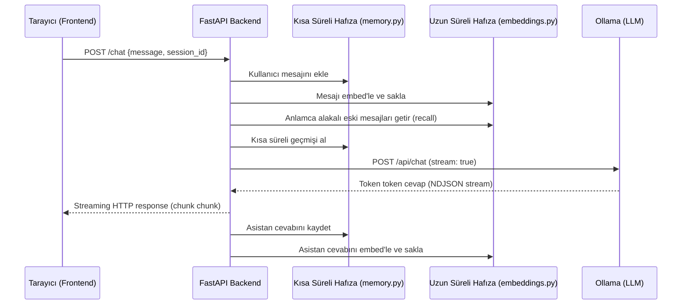

# Local AI Chat

Ollama üzerinde çalışan bir yerel LLM ile sohbet eden, yanıtları token token (streaming) gösteren, kısa ve uzun süreli hafızaya sahip bir sohbet uygulaması. Herhangi bir bulut API'sine veya internet bağlantısına ihtiyaç duymadan, tamamen kendi bilgisayarınızda çalışır.

## İçindekiler

- [Özellikler](#özellikler)
- [Mimari](#mimari)
- [Kullanılan Teknolojiler](#kullanılan-teknolojiler)
- [Proje Yapısı](#proje-yapısı)
- [Gereksinimler](#gereksinimler)
- [Kurulum](#kurulum)
- [Çalıştırma](#çalıştırma)
- [Kullanım](#kullanım)
- [Yapılandırma](#yapılandırma)
- [Bilinen Sınırlamalar](#bilinen-sınırlamalar)
- [Olası Geliştirmeler](#olası-geliştirmeler)
- [Neden Yerel LLM?](#neden-yerel-llm)
- [Lisans](#lisans)

## Özellikler

- **Streaming yanıtlar** — model cevabı üretirken kelime kelime ekrana akar, tüm cevabın bitmesini beklemek gerekmez.
- **Kısa süreli hafıza** — her oturum (session) kendi konuşma geçmişini tutar, model önceki mesajları hatırlayarak cevap verir.
- **Uzun süreli hafıza (mini-RAG)** — her mesaj embedding'e çevrilip ayrı bir depoda saklanır; kısa süreli hafızadan düşen eski bilgiler bile, anlamca alakalı olduklarında cosine similarity ile tekrar bulunup modele hatırlatılır.
- **Tamamen yerel** — sohbet verisi hiçbir zaman kendi bilgisayarınızın dışına çıkmaz, internet bağlantısı olmadan da çalışır.
- **Sade, framework'süz frontend** — build adımı gerektirmeyen düz HTML/CSS/JS arayüz.

## Mimari



Backend, Ollama'nın yerel HTTP API'sine (`http://localhost:11434`) istek atan ince bir katman görevi görür. Frontend'e ise FastAPI'nin kendisi statik dosya olarak servis eder — ayrı bir web sunucusuna gerek yoktur.

## Kullanılan Teknolojiler

| Katman | Teknoloji | Amaç |
|---|---|---|
| LLM çalıştırma | [Ollama](https://ollama.com) | Modeli yerelde çalıştırıp HTTP API olarak sunar |
| Sohbet modeli | `llama3.2:3b` (veya `qwen2.5:3b`) | Metin üretimi |
| Embedding modeli | `nomic-embed-text` | Metni vektöre çevirme (uzun süreli hafıza için) |
| Backend framework | [FastAPI](https://fastapi.tiangolo.com/) | HTTP API, streaming response, statik dosya servisi |
| ASGI sunucu | [Uvicorn](https://www.uvicorn.org/) | FastAPI uygulamasını ayağa kaldırma |
| HTTP client | [httpx](https://www.python-httpx.org/) | Ollama'ya async streaming istekler atma |
| Veri doğrulama | [Pydantic](https://docs.pydantic.dev/) | Gelen isteklerin şemasını doğrulama (FastAPI ile birlikte gelir) |
| Sayısal işlemler | [NumPy](https://numpy.org/) | Cosine similarity hesaplama |
| Frontend | Düz HTML / CSS / JavaScript | Build adımı olmayan sade sohbet arayüzü |
| Streaming (tarayıcı) | `fetch` + `ReadableStream` | Backend'den gelen akışı canlı olarak ekrana yazma |

## Proje Yapısı

```
local-ai-chat/
├── backend/
│   ├── main.py            # FastAPI uygulaması, /chat route'u, frontend'i mount eder
│   ├── ollama_client.py   # Ollama'nın /api/chat endpoint'ine streaming istek atar
│   ├── memory.py          # Session bazlı kısa süreli konuşma geçmişi (RAM içinde)
│   ├── embeddings.py      # Mesajları embed'ler, uzun süreli hafıza + benzerlik araması
│   └── requirements.txt   # Python bağımlılıkları
├── frontend/
│   ├── index.html         # Sayfa iskeleti
│   ├── style.css          # Sohbet arayüzü stilleri
│   └── app.js             # Fetch + streaming okuma, DOM güncelleme
├── .gitignore
└── README.md
```

## Gereksinimler

- **Python 3.10+**
- **[Ollama](https://ollama.com/download)** kurulu ve arka planda çalışıyor olmalı
- Modeller için yaklaşık **3-5 GB** boş disk alanı
- Modern bir tarayıcı (Chrome, Edge, Firefox — `fetch` + `ReadableStream` desteği olan herhangi biri)

## Kurulum

1. **Repoyu klonlayın / indirin** ve proje klasörüne girin:

   ```bash
   git clone <repo-url> local-ai-chat
   cd local-ai-chat
   ```

2. **Python sanal ortamı oluşturun ve aktive edin** (`backend/` klasöründe):

   ```bash
   cd backend
   python -m venv .venv
   ```

   Windows (PowerShell):
   ```powershell
   .venv\Scripts\Activate.ps1
   ```

   macOS / Linux:
   ```bash
   source .venv/bin/activate
   ```

3. **Python bağımlılıklarını kurun:**

   ```bash
   pip install -r requirements.txt
   ```

4. **Ollama'yı kurun** (kurulu değilse): [ollama.com/download](https://ollama.com/download)

5. **Gerekli modelleri indirin:**

   ```bash
   ollama pull llama3.2:3b
   ollama pull nomic-embed-text
   ```

   > Daha güçlü bir sohbet kalitesi isterseniz ve makinenizde yeterli RAM varsa (8 GB+ boş), `qwen2.5:3b` veya `qwen2.5:7b-instruct` da denenebilir — bkz. [Yapılandırma](#yapılandırma).

## Çalıştırma

`backend/` klasöründeyken, sanal ortam aktifken:

```bash
uvicorn main:app --reload --port 8000
```

Terminalde `Uvicorn running on http://127.0.0.1:8000` satırını gördükten sonra tarayıcıda şu adrese gidin:

```
http://127.0.0.1:8000
```

## Kullanım

- Mesaj kutusuna yazıp **Gönder**'e basın veya iki yeni satır tuşuna basın.
- Cevap kelime kelime akarak gelir.
- Sayfa aynı sekmede kaldığı sürece (veya yenilendiğinde, `sessionStorage` sayesinde) konuşma geçmişi korunur.
- Sekme kapatılıp yeniden açıldığında yeni bir oturum (session) başlar; sunucu yeniden başlatıldığında ise **tüm hafıza** (kısa ve uzun süreli) sıfırlanır — bkz. [Bilinen Sınırlamalar](#bilinen-sınırlamalar).

## Yapılandırma

Şu an tüm ayarlar kod içinde sabit (constant) olarak tutuluyor — küçük bir projede en basit yaklaşım budur, ama büyütmek isterseniz bunları `.env` dosyasına taşıyabilirsiniz.

| Ayar | Dosya | Açıklama |
|---|---|---|
| `MODEL_NAME` | `backend/ollama_client.py` | Sohbet için kullanılacak model (örn. `llama3.2:3b`, `qwen2.5:3b`) |
| `EMBED_MODEL` | `backend/embeddings.py` | Embedding için kullanılacak model |
| `MAX_HISTORY` | `backend/memory.py` | Kısa süreli hafızada tutulacak maksimum mesaj sayısı |
| `OLLAMA_URL` / `OLLAMA_EMBED_URL` | `backend/ollama_client.py`, `backend/embeddings.py` | Ollama'nın çalıştığı adres (varsayılan: `http://localhost:11434`) |

## Bilinen Sınırlamalar

Bunlar bilinçli olarak MVP kapsamında basit tutulan noktalar:

- **Kalıcı olmayan depolama** — hem kısa hem uzun süreli hafıza RAM'de (process içi) tutulur; sunucu yeniden başlatıldığında tüm geçmiş kaybolur. Kalıcılık için SQLite'a geçmek gerekir.
- **Küçük modelin dil kalitesi** — `llama3.2:3b` gibi küçük modeller, özellikle Türkçe'de zaman zaman tutarsız veya İngilizce kelimelerle karışık cevaplar üretebilir. Bu bir model sınırlamasıdır, uygulama mimarisinden kaynaklanmaz.
- **Basit context kırpma** — `MAX_HISTORY`, mesaj *sayısına* göre kırpma yapar, token sayısına göre değil; çok uzun mesajlarda context penceresi yine de aşılabilir.
- **Tek process, tek kullanıcı odaklı** — kimlik doğrulama (authentication) yok, üretim (production) ortamı için tasarlanmadı.
- **Doğrusal arama (linear search)** — `embeddings.py`, benzerlik aramasını depodaki tüm vektörlerle tek tek karşılaştırarak yapar; binlerce mesaja çıkan bir depoda yavaşlar (bu ölçekte bir sorun değildir).

## Olası Geliştirmeler

- Hafızayı SQLite veya benzeri bir veritabanına taşıyarak kalıcı hale getirmek
- Depo büyüdükçe FAISS / ChromaDB gibi gerçek bir vektör veritabanına geçmek
- Çoklu kullanıcı desteği ve basit bir authentication katmanı eklemek
- Projeyi Docker ile paketleyip tek komutla ayağa kaldırılabilir hale getirmek
- `ollama_client.py` ve `embeddings.py` için birim testleri yazmak
- Ayarları `.env` dosyasına taşımak

## Neden Yerel LLM?

Bulut tabanlı bir API (OpenAI, Anthropic vb.) yerine yerel bir modeli tercih etmenin başlıca sebepleri:

- **Gizlilik** — sohbet verisi hiçbir zaman kendi makinenizin dışına çıkmaz.
- **Maliyet** — API kullanım ücreti yoktur, tek maliyet elektrik ve donanımdır.
- **Çevrimdışı çalışma** — internet bağlantısı olmadan da tamamen işlevseldir.
- **Kontrol** — hangi modelin, hangi versiyonun kullanıldığı tamamen sizin elinizdedir.

Bunun karşılığında ödenen bedel, küçük modellerin büyük bulut modellerine göre daha sınırlı bir dil kalitesi sunmasıdır — bu proje, bu ödünleşimi (trade-off) somut olarak göstermek için de iyi bir örnektir.

## Lisans

MIT
